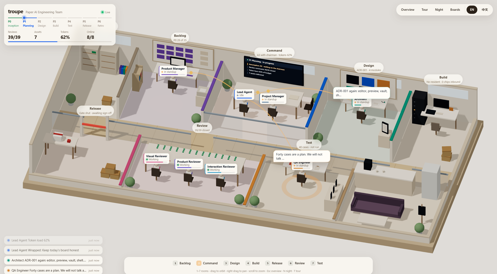
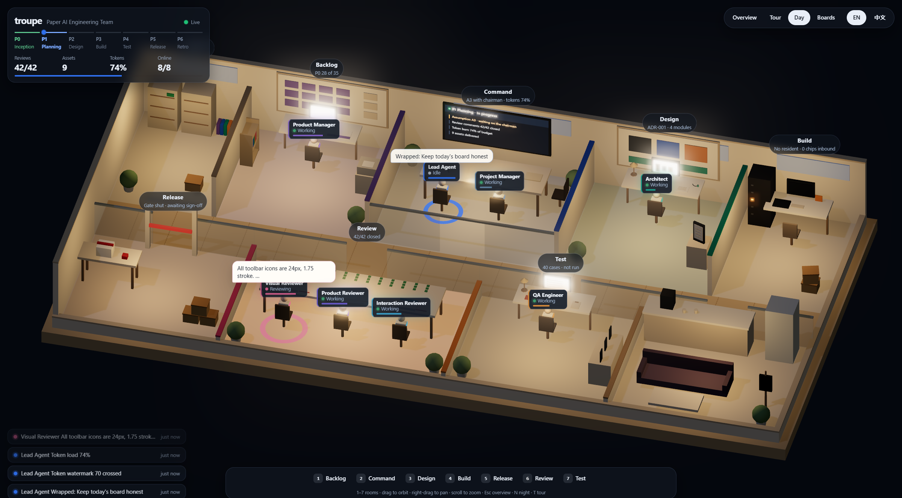
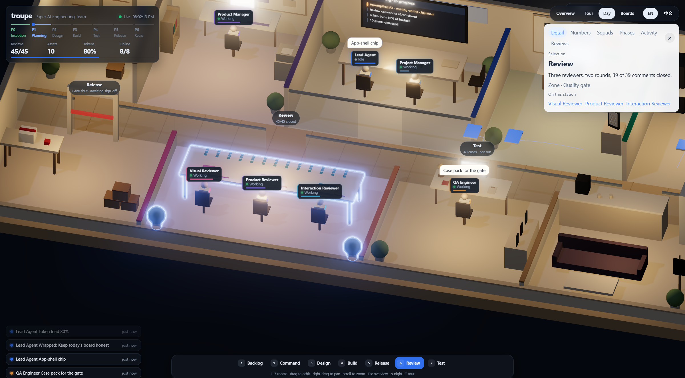

# troupe —— 你的 AI 工程剧团

> 一支全 AI 工程团队的实时战况室。一整层公司楼面，等距，可切昼夜。

英文 *company* 同时是「公司」和「剧团」：战况室是剧院，楼面是舞台。点一个人或一间房，右侧抽屉才打开。评审会、站会、某个人手头的活，都在抽屉里。

换一份 `team.config.json`，同一块场地就为另一支团队服务。这就是开箱即用。

[English](README.md)

## 本地运行

在仓库根目录：

```bash
npm install
npm run dev
```

打开 http://127.0.0.1:5173/。页面由模拟导演启动，不需要后端，不需要登录，three.js 也不会在运行时去拉 CDN（库已经打进包里）。

```bash
npm run typecheck
npm run lint
npm run build
```

`npm run build` 的产物在 `projects/warroom/app/dist`。

语言跟随浏览器（`zh*` 用 zh-CN，否则英文）。缺翻译键时回退英文。右上角工具条里的 EN / 中文会立刻切换。

## 这一层楼



楼把画面铺满。九间房共用墙。后排是立项、需求池、指挥、设计、实现。前排是发布、评审、测试，以及茶水休息室。两排之间是一条木地板走廊。



19:00 到 07:00 打开页面就是夜间。房间暖光、指挥室大屏和台灯撑起这一层。夜间 / 白天，或者按 `N`，可以切换。



点一间房、一个人，或者按 `1` 到 `7`。镜头飞过去，抽屉在右侧打开，不挡住这间房。拖动旋转，右键平移，滚轮缩放。`Esc` 回到总览。`T` 按七间房巡游，手一动镜头就停。

人名牌上有状态和任务进度。新事件会在那个人头顶升起一句气泡。站会、碰头、私聊只在真正在场的人之间连一道弧。交接的文件是一叠发光的卷宗，沿走廊送过去。发布闸门要等董事长署名才抬起来。

没有 WebGL 时页面不空白：顶上有一条说明，产区改成平面看板。本机有 WebGL 时，地址加上 `?nowebgl=1` 可以看到这条兜底。

## 换成另一支团队

组织数据全在一个文件里：

`projects/warroom/app/team.config.json`

里面有剧团名、成员、小队、站点、产区、阶段、评审剧本、站会台词、私聊、敲定、评分、Token 阈值和开场数字。`packages/team-config` 在启动时校验形状。文件坏了，错误列表会画在 `#warroom` 里，而不是白屏。

成员 `id` 保持稳定。`aliases` 用来把控制台事件（例如 `actor: "架构师"`）对上人。面向读者的句子写成 `{ "en", "zh-CN" }`。界面铬件（按钮、面板标题）留在 `projects/warroom/app/src/i18n/en.json` 和 `zh-CN.json`。

## 事件 schema

整块场地只读一条总线：

```ts
window.TeamEvents.push({
  type: 'task_done',
  actor: '架构师',
  action: '提交 ADR-002',
  ts: Date.now(),
});
```

动态、架构师的手头任务、已交付资产数，都从这次调用更新。面板不会自己用定时器写团队数据。

覆盖的类型：`task_started`、`task_progress`、`task_done`、`task_handoff`、`review_comment`、`meeting_speech`、`dm_message`、`member_online`、`member_offline`、`member_pose`、`phase_changed`、`report_standup`、`report_weekly`、`version_signoff`、`alignment_done`、`review_score`、`cost_report`、`budget_alert`、`escalation_urgent`、`alert_cleared`、`scene_cue`。

`escalation_urgent` 的 `payload.level` 为 `P0` 或 `P1`。私聊（`dm_message`）的正文在 `payload.text`，公开动态只说这两个人在说话。

完整表在 [docs/zh-CN/EVENT-SCHEMA.md](docs/zh-CN/EVENT-SCHEMA.md)。

## 真实 agent 事件源接在哪里

`packages/team-events/src/realtime-adapter.ts` 是空的事件源。方法体标了 `REAL-SOURCE`。在 `start` 里用 WebSocket 或 SSE 把每一帧交给 `push`，在 `stop` 里关掉连接。

从 `projects/warroom/app/src/main.ts` 打开：

```ts
bus.setAdapter(new RealtimeAdapter());
```

这种模式下不要再启动 `SimulationEngine`。场景和面板无论哪边在推，都只订阅总线，所以不用改。

## 目录

```
troupe/
├── projects/paper/          Paper，剧团的第一个产品
├── projects/warroom/app/    这块场地（公开，开箱即用）
├── crew/                    演员脚本（只在 dev 分支）
├── packages/                事件总线、配置校验、模拟
└── docs/                    公司级双语文档
```

先公司，后项目。依赖只允许 `projects → packages`。

`main` 是公开面：应用、`packages/`、各项目的 `PROJECT.md`、公开文档，以及本 README。它不包含 `crew/`，也不包含任何项目的 `team/`、`milestones/`、`deliverables/`。那些在 `dev`。见 [CONTRIBUTING.md](CONTRIBUTING.md)。

## 你在看的这场戏

`packages/simulation` 里的导演循环演出：站会、一场没谈拢的私聊、只叫相关人的碰头、39 条评审意见里的一段、芯片从设计流到实现、测试、评审、发布、周五纪要、版本敲定、双向考评。Token 水位走过 70 / 85 / 100 / 120。到 120，停职预案让剧团休眠，然后再复职。每隔一轮会升起红色警报，下一场让路，直到警报解除。

人坐在自己的房间里。跨房间的活是走廊上的一卷宗，不是一次通勤。
